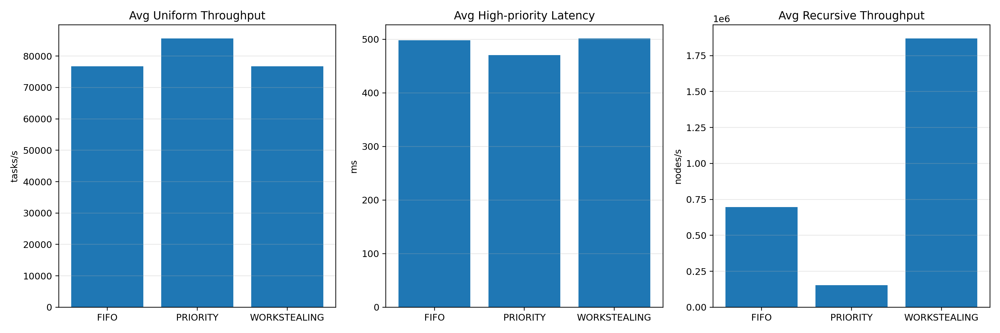
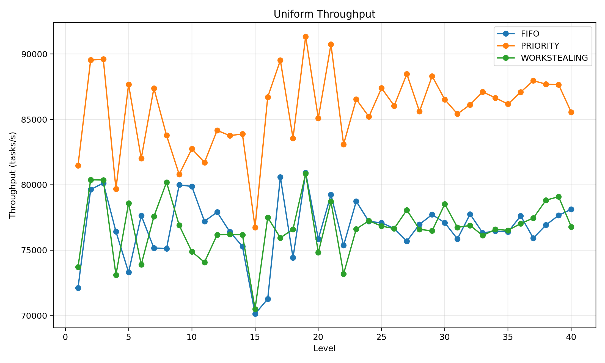
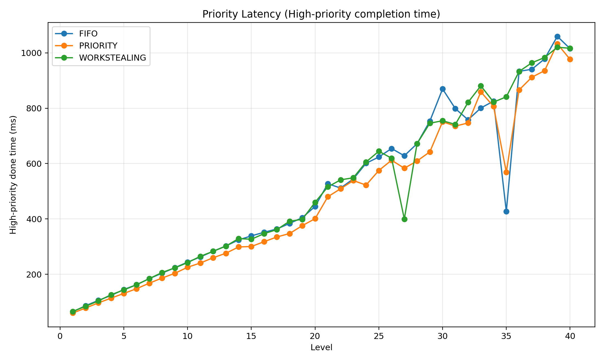
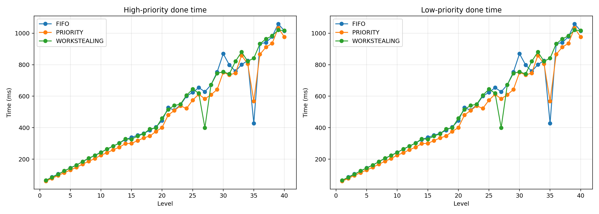
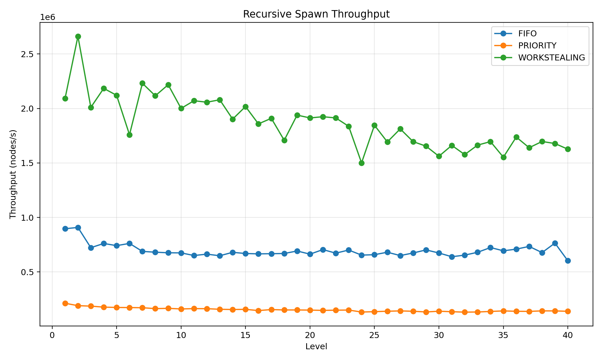
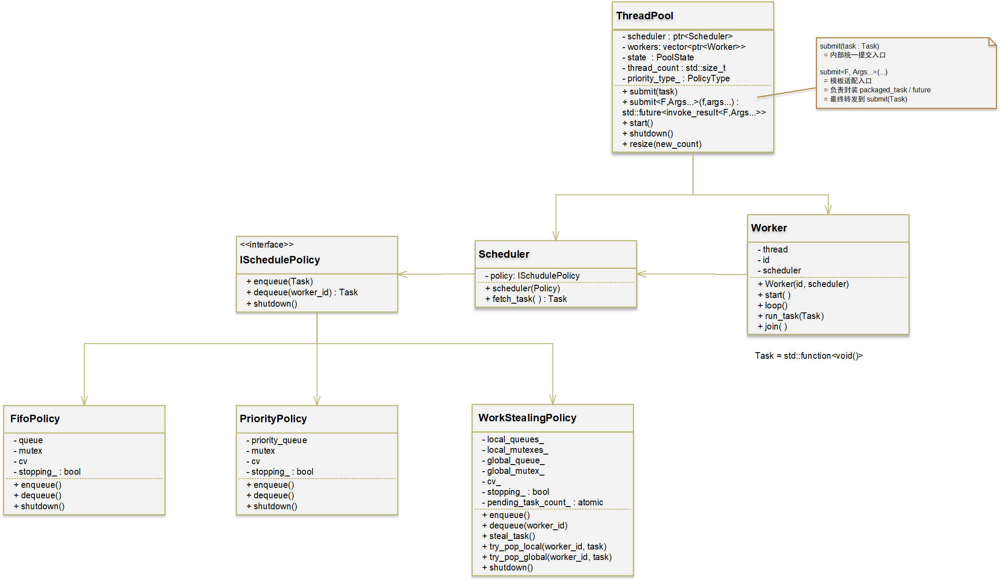

# ThreadPool: Multi-Policy C++ Thread Pool

A production-oriented C++17 thread pool with three scheduling strategies:

- **FIFO** for predictable general-purpose batch execution
- **PRIORITY** for latency-sensitive tasks
- **WORKSTEALING** for recursive or highly imbalanced workloads

This project provides a unified `ThreadPool` interface, policy-based scheduling, graceful shutdown semantics, future-based task submission, benchmark workloads, and business-oriented workload tests.

---

## Project Features

- C++17 implementation based on `std::thread`, `std::future`, `std::packaged_task`, `std::mutex`, and `std::condition_variable`
- Unified thread pool API with policy selection at construction time
- Three scheduling policies:
  - **FIFO**
  - **PRIORITY**
  - **WORKSTEALING**
- Graceful shutdown with worker joining
- Support for ordinary task submission and future-returning task submission
- Dedicated policy benchmarks
- Business-oriented test workloads for deeper validation

---

## Project Structure

```text
threadpool/
├── benchmarks/
├── build/
├── include/thread_pool/
│   ├── policy.h
│   ├── scheduler.h
│   ├── task.h
│   ├── thread_pool.h
│   └── worker.h
├── policies/
│   ├── fifo_policy.h / fifo_policy.cpp
│   ├── priority_policy.h / priority_policy.cpp
│   └── work_stealing_policy.h / work_stealing_policy.cpp
├── src/
│   ├── scheduler.cpp
│   ├── thread_pool.cpp
│   └── worker.cpp
├── tests/
│   ├── test_fifo_policy.cpp
│   ├── test_priority_policy.cpp
│   ├── test_work_stealing_policy.cpp
│   ├── test_policy_benchmark.cpp
│   ├── test_business_fifo_batch.cpp
│   ├── test_business_priority_service.cpp
│   ├── test_business_shutdown_burst.cpp
│   └── test_business_workstealing_tiles.cpp
├── CMakeLists.txt
└── README.md
```

---

## UML Architecture



## Core API

### Policy Selection

```cpp
thread_pool::ThreadPool pool(4, thread_pool::PolicyType::FIFO);
thread_pool::ThreadPool pool2(4, thread_pool::PolicyType::PRIORITY);
thread_pool::ThreadPool pool3(4, thread_pool::PolicyType::WORKSTEALING);
```

### Basic Usage

```cpp
pool.start();

pool.submit([] {
    // work
});

auto fut = pool.submit([]() -> int {
    return 42;
});

int result = fut.get();
pool.shutdown();
```

### Priority Submission

```cpp
thread_pool::ScheduleOptions opts;
opts.priority = 10;

pool.submit([] {
    // high-priority task
}, opts);
```

---

## Benchmark Suite

The benchmark program evaluates three policy workloads:

1. **Uniform Throughput**
2. **Priority Latency**
3. **Recursive Spawn Throughput**

### Benchmark Source

- `tests/test_policy_benchmark.cpp`

### Benchmark Dimensions

- Policies tested: `FIFO`, `PRIORITY`, `WORKSTEALING`
- Levels: **1 to 40**
- Repeated workload execution and result aggregation to `policy_benchmark_results.csv`
- Visualization generated from the benchmark CSV

### Benchmark Workload Settings

#### 1. Uniform Throughput

Purpose:
- Measure raw scheduling throughput under homogeneous tasks

Configuration:
- Same-sized independent tasks
- Same number of logical workload levels from 1 to 40
- Report metric: **tasks/s**

#### 2. Priority Latency

Purpose:
- Measure completion time of high-priority tasks under mixed-priority load

Configuration:
- Mixed high-priority and low-priority submissions
- Compare **high-priority completion time** and **low-priority completion time**
- Report metric: **ms**

#### 3. Recursive Spawn Throughput

Purpose:
- Measure how efficiently a policy handles recursively generated tasks

Configuration:
- Tasks dynamically submit child tasks
- Increasing recursion depth / level from 1 to 40
- Report metric: **nodes/s**

---

## Benchmark Results

### Result Summary


Based on the included benchmark plots:

- **Uniform throughput**: `PRIORITY` delivers the highest average throughput, about **85k tasks/s**; `FIFO` and `WORKSTEALING` are both around **76k tasks/s**.
- **High-priority latency**: `PRIORITY` achieves the best average high-priority completion time, about **470 ms**, lower than `FIFO` and `WORKSTEALING`.
- **Recursive spawn throughput**: `WORKSTEALING` is dominant at about **1.86M nodes/s**, clearly ahead of `FIFO` and `PRIORITY`.

### Uniform Throughput Curve



Interpretation:
- `PRIORITY` maintains the strongest throughput across most levels.
- `FIFO` and `WORKSTEALING` are close in this workload and remain stable over the level sweep.

### Priority Latency Curve



Interpretation:
- `PRIORITY` consistently improves high-priority completion time over the mixed-priority workload.
- The latency advantage becomes more visible as the level increases.

### Dual Priority Completion Curves



Interpretation:
- High-priority and low-priority completion trends are both tracked.
- `PRIORITY` provides better response for high-priority tasks while preserving stable processing for lower-priority tasks.

### Recursive Spawn Throughput Curve



Interpretation:
- `WORKSTEALING` is the correct policy for recursive and dynamically generated tasks.
- The gap against `FIFO` and `PRIORITY` is substantial and sustained across the entire level range.

### Benchmark Conclusion

- **FIFO** is a strong baseline for general workloads.
- **PRIORITY** is the best choice for latency-sensitive and mixed-priority services.
- **WORKSTEALING** is the best choice for recursive decomposition and imbalanced parallel workloads.

---

## Business-Oriented Workload Tests

In addition to synthetic benchmarks, this project includes four business-oriented workloads that exercise deeper runtime behavior.

### 1. Priority Service Test

Source:
- `tests/test_business_priority_service.cpp`

Policy:
- `PRIORITY`

Scenario:
- Simulated online service requests with three priority classes:
  - low-priority background jobs
  - medium-priority normal requests
  - high-priority critical requests

Configuration:
- **20 low-priority tasks**
- **40 medium-priority tasks**
- **20 high-priority tasks**
- Low-priority tasks: about **90–110 ms**
- Medium-priority tasks: about **25–40 ms**
- High-priority tasks: about **8–12 ms**

Validation target:
- High-priority tasks complete earlier on average than low-priority tasks
- Mixed service load does not block critical requests

### 2. Work-Stealing Tile Processing Test

Source:
- `tests/test_business_workstealing_tiles.cpp`

Policy:
- `WORKSTEALING`

Scenario:
- Simulated image-tile processing with imbalanced task cost and dynamic subtask generation

Configuration:
- **64 root tile tasks**
- Light tasks: about **10–22 ms**
- Heavy tasks: about **70–100 ms**
- Heavy tiles generate **4 child subtasks** each
- Child subtasks: about **18–30 ms**

Validation target:
- Dynamic subtasks are fully executed
- Multiple workers participate
- The pool remains correct under nested submission

### 3. FIFO Batch Processing Test

Source:
- `tests/test_business_fifo_batch.cpp`

Policy:
- `FIFO`

Scenario:
- Simulated offline batch jobs with normal work and controlled task failures

Configuration:
- **120 batch tasks**
- Task duration: about **12–24 ms**
- Every task with `i % 17 == 0` throws an exception
- Futures are collected and verified
- Additional follow-up tasks are submitted after failures

Validation target:
- Exceptions propagate through `future`
- Worker threads continue processing after task failures
- The thread pool stays usable after exception-bearing tasks

### 4. Shutdown Burst Test

Source:
- `tests/test_business_shutdown_burst.cpp`

Policy:
- `FIFO`

Scenario:
- Simulated burst traffic during shutdown

Configuration:
- **4 producer threads**
- Each producer attempts **80 submissions**
- Short tasks: about **10 ms**
- Every 10th task is a long task: about **70 ms**
- Main thread triggers `shutdown()` while producers are still active

Validation target:
- Accepted tasks are all completed
- Rejected submissions occur after shutdown begins
- No accepted task is lost
- Futures of accepted tasks become ready before process exit

---

## Build

### CMake

```bash
mkdir -p build
cd build
cmake ..
make -j
```

### Example Manual Build

```bash
g++ -std=c++17 -pthread \
    ./tests/test_policy_benchmark.cpp \
    ./src/thread_pool.cpp \
    ./src/scheduler.cpp \
    ./src/worker.cpp \
    ./policies/fifo_policy.cpp \
    ./policies/priority_policy.cpp \
    ./policies/work_stealing_policy.cpp \
    -I./include \
    -I./policies \
    -o ./build/tests/test_policy_benchmark
```

---

## Running Tests

```bash
./build/tests/test_fifo_policy
./build/tests/test_priority_policy
./build/tests/test_work_stealing_policy
./build/tests/test_policy_benchmark
./build/tests/test_business_priority_service
./build/tests/test_business_workstealing_tiles
./build/tests/test_business_fifo_batch
./build/tests/test_business_shutdown_burst
```

---

## Technical Summary

This project demonstrates that different scheduling policies serve different workload classes:

- **FIFO** provides a stable and predictable default behavior.
- **PRIORITY** is designed for service quality and priority-sensitive execution.
- **WORKSTEALING** is optimized for recursive decomposition and non-uniform work distribution.

The benchmark suite and business-oriented tests together show both policy-level performance and engineering-level correctness.

---

# ThreadPool：多策略 C++ 线程池

这是一个面向工程实现的 **C++17 线程池项目**，支持三种调度策略：

- **FIFO**：适合通用批处理与可预测执行
- **PRIORITY**：适合延迟敏感型任务
- **WORKSTEALING**：适合递归拆分和负载不均衡任务

该项目提供统一的 `ThreadPool` 接口、基于策略的调度器、优雅关闭语义、基于 future 的任务提交、基准测试，以及面向业务场景的工作负载测试。

---

## 项目特性

- 基于 `std::thread`、`std::future`、`std::packaged_task`、`std::mutex`、`std::condition_variable` 的 C++17 实现
- 线程池在构造时选择调度策略
- 三种调度策略：
  - **FIFO**
  - **PRIORITY**
  - **WORKSTEALING**
- 支持优雅关闭与 worker 线程回收
- 支持普通任务提交与 future 返回值任务提交
- 提供独立的策略 benchmark
- 提供更接近真实业务的 workload 测试

---

## 项目结构

```text
threadpool/
├── benchmarks/
├── build/
├── include/thread_pool/
│   ├── policy.h
│   ├── scheduler.h
│   ├── task.h
│   ├── thread_pool.h
│   └── worker.h
├── policies/
│   ├── fifo_policy.h / fifo_policy.cpp
│   ├── priority_policy.h / priority_policy.cpp
│   └── work_stealing_policy.h / work_stealing_policy.cpp
├── src/
│   ├── scheduler.cpp
│   ├── thread_pool.cpp
│   └── worker.cpp
├── tests/
│   ├── test_fifo_policy.cpp
│   ├── test_priority_policy.cpp
│   ├── test_work_stealing_policy.cpp
│   ├── test_policy_benchmark.cpp
│   ├── test_business_fifo_batch.cpp
│   ├── test_business_priority_service.cpp
│   ├── test_business_shutdown_burst.cpp
│   └── test_business_workstealing_tiles.cpp
├── CMakeLists.txt
└── README.md
```

---

## UML 架构图



## 核心 API

### 策略选择

```cpp
thread_pool::ThreadPool pool(4, thread_pool::PolicyType::FIFO);
thread_pool::ThreadPool pool2(4, thread_pool::PolicyType::PRIORITY);
thread_pool::ThreadPool pool3(4, thread_pool::PolicyType::WORKSTEALING);
```

### 基本使用

```cpp
pool.start();

pool.submit([] {
    // 执行任务
});

auto fut = pool.submit([]() -> int {
    return 42;
});

int result = fut.get();
pool.shutdown();
```

### 带优先级提交

```cpp
thread_pool::ScheduleOptions opts;
opts.priority = 10;

pool.submit([] {
    // 高优先级任务
}, opts);
```

---

## Benchmark 测试

该项目的 benchmark 程序评估三类典型工作负载：

1. **Uniform Throughput**
2. **Priority Latency**
3. **Recursive Spawn Throughput**

### Benchmark 源文件

- `tests/test_policy_benchmark.cpp`

### Benchmark 设置

- 参与对比的策略：`FIFO`、`PRIORITY`、`WORKSTEALING`
- 测试等级：**1 到 40**
- 多轮运行并汇总输出到 `policy_benchmark_results.csv`
- 再由脚本读取 CSV 生成可视化图表

### Benchmark 代码中的工作负载设置

#### 1. Uniform Throughput

目标：
- 测量策略在同质任务下的纯调度吞吐能力

设置：
- 任务规模一致、彼此独立
- level 从 1 到 40 递增
- 指标：**tasks/s**

#### 2. Priority Latency

目标：
- 测量混合优先级负载下高优先级任务的完成时间

设置：
- 同时提交高优先级任务和低优先级任务
- 统计 **高优先级完成时间** 与 **低优先级完成时间**
- 指标：**ms**

#### 3. Recursive Spawn Throughput

目标：
- 测量策略处理递归派生任务的效率

设置：
- 任务在执行过程中继续提交子任务
- 递归层级 / level 从 1 到 40 递增
- 指标：**nodes/s**

---

## Benchmark 结果

### 汇总图


根据当前项目附带的 benchmark 结果图：

- **Uniform throughput**：`PRIORITY` 的平均吞吐最高，约 **85k tasks/s**；`FIFO` 与 `WORKSTEALING` 都在 **76k tasks/s** 左右。
- **High-priority latency**：`PRIORITY` 的高优先级平均完成时间最低，约 **470 ms**，优于 `FIFO` 与 `WORKSTEALING`。
- **Recursive spawn throughput**：`WORKSTEALING` 约 **1.86M nodes/s**，显著高于 `FIFO` 与 `PRIORITY`。

### Uniform Throughput 曲线


结果说明：
- `PRIORITY` 在大多数 level 下都维持了最高吞吐。
- `FIFO` 与 `WORKSTEALING` 在这个同质任务场景下表现接近，且整体较稳定。

### Priority Latency 曲线


结果说明：
- `PRIORITY` 在混合优先级场景中能更快完成高优先级任务。
- 随着 level 增加，这一优势更加明显。

### 双优先级完成曲线


结果说明：
- 图中同时展示了高优先级与低优先级任务完成时间。
- `PRIORITY` 在保障高优先级响应的同时，低优先级任务处理也保持稳定。

### Recursive Spawn Throughput 曲线


结果说明：
- `WORKSTEALING` 非常适合递归派生和动态任务生成场景。
- 它与 `FIFO`、`PRIORITY` 的差距不仅明显，而且在整个 level 范围内持续存在。

### Benchmark 结论

- **FIFO**：适合作为通用基线策略。
- **PRIORITY**：适合强调服务质量和高优先级响应的任务。
- **WORKSTEALING**：适合递归拆分和负载不均衡并行任务。

---

## 业务工作负载测试

除了 synthetic benchmark 以外，项目还提供了四个更贴近真实工程行为的业务测试，用来验证线程池的深层运行特性。

### 1. Priority Service Test

源文件：
- `tests/test_business_priority_service.cpp`

使用策略：
- `PRIORITY`

场景：
- 模拟在线服务请求，分为三类优先级：
  - 低优先级后台任务
  - 中优先级普通请求
  - 高优先级关键请求

设置：
- **20 个低优先级任务**
- **40 个中优先级任务**
- **20 个高优先级任务**
- 低优先级任务耗时约 **90–110 ms**
- 中优先级任务耗时约 **25–40 ms**
- 高优先级任务耗时约 **8–12 ms**

验证目标：
- 高优先级任务的平均完成速度快于低优先级任务
- 混合服务负载下关键请求不会被后台任务阻塞

### 2. Work-Stealing Tile Processing Test

源文件：
- `tests/test_business_workstealing_tiles.cpp`

使用策略：
- `WORKSTEALING`

场景：
- 模拟图像 tile 分块处理，包含负载不均衡和动态子任务派生

设置：
- **64 个根任务**
- 轻任务耗时约 **10–22 ms**
- 重任务耗时约 **70–100 ms**
- 每个重任务再派生 **4 个子任务**
- 子任务耗时约 **18–30 ms**

验证目标：
- 动态子任务全部完成
- 多个 worker 都参与执行
- 嵌套提交场景下线程池行为仍然正确

### 3. FIFO Batch Processing Test

源文件：
- `tests/test_business_fifo_batch.cpp`

使用策略：
- `FIFO`

场景：
- 模拟离线批处理任务，同时引入受控异常

设置：
- **120 个批处理任务**
- 单任务耗时约 **12–24 ms**
- 满足 `i % 17 == 0` 的任务抛出异常
- 所有 future 都进行回收与校验
- 在异常任务之后继续补充提交一批后续任务

验证目标：
- 异常通过 `future` 正确传播
- worker 在线程池内部继续存活并执行后续任务
- 线程池在异常发生后仍可继续使用

### 4. Shutdown Burst Test

源文件：
- `tests/test_business_shutdown_burst.cpp`

使用策略：
- `FIFO`

场景：
- 模拟系统关闭过程中的突发并发提交

设置：
- **4 个 producer 线程**
- 每个 producer 尝试提交 **80 个任务**
- 普通短任务耗时约 **10 ms**
- 每 10 个任务中插入 1 个长任务，耗时约 **70 ms**
- 主线程在 producer 仍在提交时触发 `shutdown()`

验证目标：
- 所有已接受任务都能够完整执行
- `shutdown` 开始后会出现提交拒绝
- 不会丢失任何已接受任务
- 已接受任务的 future 在进程退出前全部 ready

---

## 构建方式

### 使用 CMake

```bash
mkdir -p build
cd build
cmake ..
make -j
```

### 手动编译示例

```bash
g++ -std=c++17 -pthread \
    ./tests/test_policy_benchmark.cpp \
    ./src/thread_pool.cpp \
    ./src/scheduler.cpp \
    ./src/worker.cpp \
    ./policies/fifo_policy.cpp \
    ./policies/priority_policy.cpp \
    ./policies/work_stealing_policy.cpp \
    -I./include \
    -I./policies \
    -o ./build/tests/test_policy_benchmark
```

---

## 运行测试

```bash
./build/tests/test_fifo_policy
./build/tests/test_priority_policy
./build/tests/test_work_stealing_policy
./build/tests/test_policy_benchmark
./build/tests/test_business_priority_service
./build/tests/test_business_workstealing_tiles
./build/tests/test_business_fifo_batch
./build/tests/test_business_shutdown_burst
```

---

## 技术总结

这个项目说明了：不同调度策略对应不同类型的工作负载。

- **FIFO**：提供稳定、可预测的默认行为。
- **PRIORITY**：适合强调优先级和响应延迟的服务型负载。
- **WORKSTEALING**：适合递归拆分和负载不均衡的并行任务。

通过 benchmark 与业务测试两部分，这个项目同时展示了：

- 策略层面的性能差异
- 工程层面的正确性与可用性

